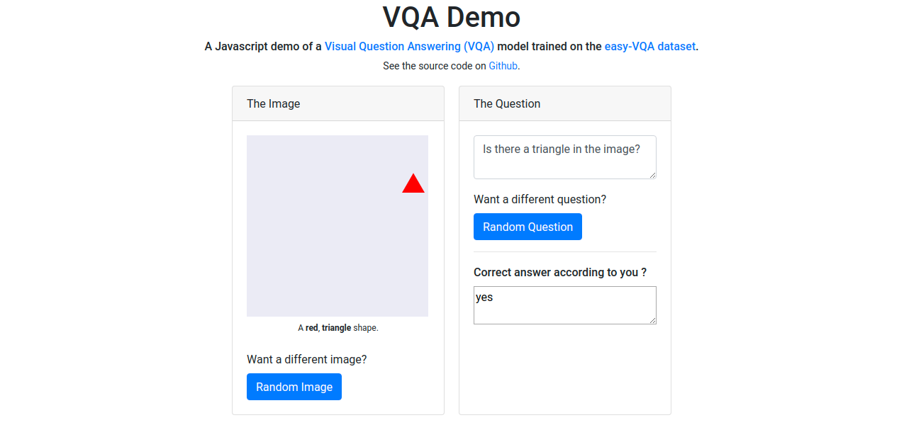
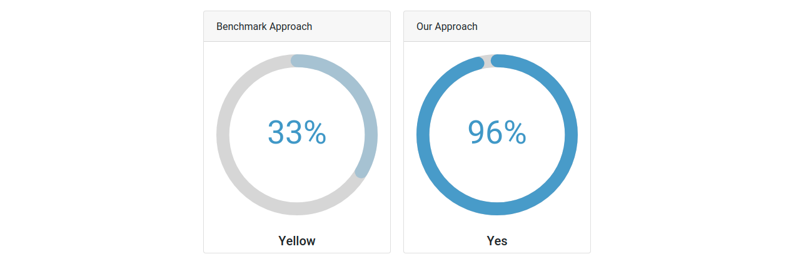

# VQA Demo

A demo of a [Keras](https://keras.io/) model trained on the shapes dataset

The model used in the demo is closely based on [Visual-Question-Answering](https://github.com/Utsavjain4561/Visual-Question-Answering).

See the demo live at http://visualquestionbot.herokuapp.com/ 


## About the Demo

The demo web app was made using [create-react-app](https://github.com/facebook/create-react-app) by Utsav Jain.

The demo model uses [TensorFlow.js](https://www.tensorflow.org/js) to run predictions using pre-trained weights directly in the browser.

The pre-trained Keras model is available at `public/newModel/model.h5`. It was converted to `public/newModel/model.json` using the official [TensorFlow.js converter](https://www.tensorflow.org/js/guide/conversion).

## Setup

```
git clone https://github.com/Utsavjain4561/VQA.git
cd VQA
npm install
npm start
```
## Results

 Through this we could easily compare the benchmark approache of VQA using a [CNN] and [BOW] networks with the approach used in the project of [VGG16] and [LSTM] models
 
